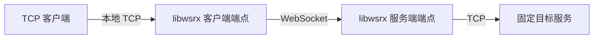

# libwsrx

`libwsrx` 是一个面向嵌入式使用的 TCP-over-WebSocket 隧道库，提供 Rust 库和 Python asyncio 扩展。它把本地 TCP 连接通过 WebSocket 转发到固定的目标 TCP 服务。

> 这不是命令行工具，也不定义用户、路由或服务发现。把它当作应用或网关中的一个传输组件。

## 它解决什么问题

当 TCP 客户端无法直接抵达目标服务、但可以抵达 WebSocket 入口时，可部署两端：



每一条源 TCP 连接都会创建一条独立的 WebSocket，并在服务端创建一条独立的目标 TCP 连接：

```text
1 TCP connection <-> 1 WebSocket connection <-> 1 TCP connection
```

隧道是全双工的，并保证同一方向的字节顺序。它只传递 WebSocket Binary Message 中的原始 TCP 字节，不添加私有帧头。WebSocket 消息边界没有业务含义，因此上层 TCP 协议仍需自行定义消息边界。

## 适用范围

已提供：

- `ws://` 传输；Rust 客户端也支持 `wss://`；
- 多条独立隧道的并发处理；
- 读块、WebSocket 消息与帧大小、连接和握手超时、并发上限配置；
- Rust Tokio API 与 Python asyncio API。

未提供：

- 多路复用、通道 ID 或自定义 WSRX framing；
- 身份认证、授权、目标发现或负载均衡；
- 自动重连、可靠重传、会话恢复、空闲超时；
- TCP half-close 的映射；
- CLI，或服务端内置 TLS 终止。

## 安装

### Rust

在调用方的 `Cargo.toml` 中使用路径依赖：

```toml
[dependencies]
libwsrx = { path = "../libwsrx" }
tokio = { version = "1", features = ["macros", "rt-multi-thread"] }
```

### Python

项目要求 Python 3.9 或更新版本。在仓库根目录执行：

```console
python -m pip install libwsrx
```

这会安装预构建的原生扩展；如果当前平台没有可用的 wheel，pip 会从源码构建。开发环境从当前源码安装的完整准备方式见[开发指南](docs/development.md)。Rust crate 目前不发布到 crates.io。

## 五分钟验证

以下示例将本机的 HTTP 服务固定为目标。它仅用于本地回环验证，不包含认证或 TLS。

先启动目标服务：

```console
python3 -m http.server 9100 --bind 127.0.0.1
```

然后运行下面的 Python 程序。它在 `9000` 启动 WebSocket 服务端，在随机本地端口启动 TCP 客户端端点。

```python
import asyncio

import libwsrx


async def main():
    server = asyncio.create_task(
        libwsrx.run_server("127.0.0.1:9000", "127.0.0.1:9100")
    )
    endpoint = await libwsrx.ClientEndpoint.bind(
        "127.0.0.1:0", "ws://127.0.0.1:9000"
    )
    try:
        print(endpoint.local_addr)
        await asyncio.Event().wait()
    finally:
        await endpoint.shutdown()
        server.cancel()
        await asyncio.gather(server, return_exceptions=True)


try:
    asyncio.run(main())
except KeyboardInterrupt:
    pass
```

程序打印出例如 `127.0.0.1:54321` 的地址后，在另一个终端访问它：

```console
curl --fail http://127.0.0.1:54321/
```

将示例地址替换为实际打印的地址。响应由 `9100` 的 HTTP 服务返回，但请求路径是本地 TCP -> WebSocket -> 目标 TCP。按 `Ctrl-C` 停止程序和临时 HTTP 服务。

## Rust 最小集成

服务端绑定 WebSocket 入口，并把每条连接转发至固定目标：

```rust
use libwsrx::{server, Config};

server::bind_and_serve(
    "127.0.0.1:9000",
    "127.0.0.1:9100".to_owned(),
    Config::default(),
)
.await?;
```

客户端端点监听本地 TCP，并为每条入站连接创建 WebSocket：

```rust
use libwsrx::{client::ClientEndpoint, Config};

let endpoint = ClientEndpoint::bind(
    "127.0.0.1:0",
    "ws://127.0.0.1:9000".to_owned(),
    Config::default(),
)
.await?;

println!("local endpoint: {}", endpoint.local_addr());
// 在应用关闭时：endpoint.shutdown().await?;
```

两段代码都应运行在 Tokio 异步上下文中。若调用方已拥有 TCP 流或监听器，可选择 `client::connect`、`client::serve`、`server::accept` 或 `server::serve`；它们把连接与生命周期的所有权留给调用方。

## Python API

| API | 使用场景 |
| --- | --- |
| `await ClientEndpoint.bind(local_addr, websocket_url, *, config=None)` | 需要获取实际监听地址，并在关闭时显式等待端点结束。`127.0.0.1:0` 会分配随机端口。 |
| `await endpoint.shutdown()` | 幂等地关闭该端点的监听器和活跃隧道。 |
| `await run_client(local_addr, websocket_url, *, config=None)` | 简单的长期运行客户端；取消 asyncio task 即可停止。 |
| `await run_server(websocket_addr, target_addr, *, config=None)` | 长期运行服务端；每条 WebSocket 都转发至同一个 `target_addr`。 |
| `Config(...)` | 调整连接限制与超时。无效值抛出 `ValueError`。 |

运行时错误会抛出 `libwsrx.WSRXError`；取消 awaitable 保持为 `asyncio.CancelledError`。

## 配置

`Config` 的默认值适合本地或受控环境。字段在 Rust 中为 `Config` 公共字段，在 Python 中为 `Config(...)` 的关键字参数。

| 字段 | 默认值 | 含义 |
| --- | ---: | --- |
| `tcp_read_buffer_size` | 65,536 | 每次 TCP 读取、并生成出站 Binary Message 的最大字节数。 |
| `max_websocket_message_size` | 67,108,864 | 单条 WebSocket Message 上限；可设为 `None` 取消限制。 |
| `max_websocket_frame_size` | 16,777,216 | 单个 WebSocket Frame 上限；可设为 `None` 取消限制。 |
| `connect_timeout` | 10 秒 | 客户端建立 WebSocket、服务端建立目标 TCP 的超时。 |
| `handshake_timeout` | 10 秒 | 服务端完成 WebSocket 握手的超时。 |
| `max_concurrent_tunnels` | 1,024 | 一个端点的最大活跃隧道数；达到上限时暂停接受新的连接。 |

所有数值和时长均必须大于零。Python 时长以有限的浮点秒数表示；Rust 可调用 `Config::validate()` 提前校验。

## 部署注意事项

服务端目标地址来自启动参数，而非 WebSocket payload。这能避免客户端直接指定任意目标，但不等于完成访问控制。生产部署应在 Upgrade 前或外围代理中完成认证与授权，并为每个入口配置允许访问的固定目标。

Rust 客户端可连接 `wss://`，使用系统原生根证书验证服务端。当前高层服务端 API 接收原始 TCP 连接，不终止 TLS；要提供 `wss://`，请在其前方放置反向代理或其他 TLS 终止层。还应由部署层设置连接时长和空闲超时，因为库没有这些策略。

## 延伸阅读

- [核心连接协议](core-connection-protocol.zh-CN.md)：数据编码、消息边界和连接生命周期。
- [开发指南](docs/development.md)：构建、测试、质量检查和本地打包。
