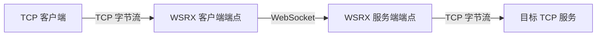
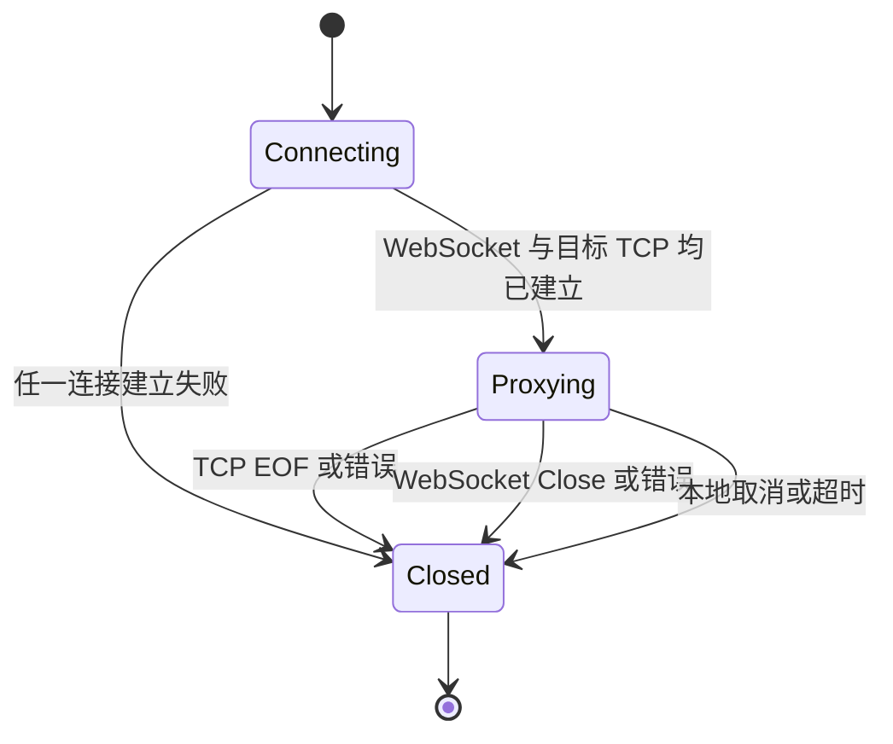

# WSRX 核心连接协议原理

## 1. 协议定位

WSRX 是一种极薄的 **TCP-over-WebSocket 隧道协议**。它使用标准 WebSocket 连接承载 TCP 字节流，不在 WebSocket payload 之上叠加新的封包格式。

核心关系为：

$$1\ \text{TCP connection} : 1\ \text{WebSocket connection} : 1\ \text{TCP connection}$$

WSRX 只解决两个端点之间的字节搬运问题，不定义上层业务消息格式，也不提供多路复用、可靠重传、服务发现或会话恢复。

## 2. 协议拓扑



一条隧道连接包含三个逻辑阶段：

1. WSRX 客户端接受或获得一条源 TCP 连接；
2. WSRX 客户端与服务端建立一条 WebSocket 连接；
3. WSRX 服务端建立目标 TCP 连接，并在两个方向转发字节。

同一服务可以并发处理多条隧道连接，但每条源 TCP 连接都使用独立的 WebSocket。不同连接之间没有共享的通道号或帧内标识。

## 3. WebSocket 建连

WSRX 使用标准 WebSocket 握手，不要求专用的应用层握手消息。

协议本身不增加：

- 魔数；
- WSRX 版本字段；
- 通道 ID；
- 目标地址字段；
- payload 长度前缀；
- 校验和；
- 首包元数据。

连接目标、访问凭据和目标 TCP 服务通常在 WebSocket Upgrade 之前确定，例如由 URL、部署配置或外围控制面指定。这些机制不属于核心数据协议。

传输可使用：

- `ws://`：明文 WebSocket；
- `wss://`：通过 TLS 保护的 WebSocket。

WSRX 不要求 `Sec-WebSocket-Protocol` 子协议。若部署环境使用该字段进行路由或协商，它属于外围约定，不改变 WSRX payload 语义。

## 4. 数据编码

### 4.1 TCP → WebSocket

从源 TCP 流读取到的一段字节，直接作为一个 WebSocket Binary Message 的 payload 发送：

```text
TCP bytes:
    b0 b1 b2 ... bn

WebSocket message:
    opcode  = Binary
    payload = b0 b1 b2 ... bn
```

没有 WSRX 自定义帧头，因此 WebSocket payload 中的每一个字节都是原始 TCP 数据。

### 4.2 WebSocket → TCP

收到 WebSocket Binary Message 后，将其 payload 按接收顺序写入目标 TCP 流：

```text
WebSocket Binary payload:
    b0 b1 b2 ... bn

TCP bytes written:
    b0 b1 b2 ... bn
```

WSRX 核心数据面使用 Binary Message。Text Message 不应作为可互操作的 TCP 数据载体；WebSocket Ping、Pong 和 Close 是连接控制消息，不进入 TCP 字节流。

### 4.3 无额外封包

WSRX 不对 payload 进行：

- Base64 或文本编码；
- 序列化；
- 压缩封装；
- 加密封装；
- 完整性校验；
- 消息类型标记。

需要这些能力时，应由 TLS、WebSocket 扩展或隧道中承载的上层 TCP 协议提供。

## 5. 字节流与消息边界

TCP 是字节流协议，WebSocket 是消息协议。WSRX 利用 WebSocket Message 搬运字节，但不赋予 Message 边界任何业务含义。

因此：

- 一次 TCP `write()` 可能被拆成多个 WebSocket Message；
- 多次 TCP `write()` 可能被合并为一个 WebSocket Message；
- 一个 WebSocket Message 写入目标 TCP 后，目标应用可能分多次 `read()` 得到；
- WebSocket 底层分片边界不属于 WSRX 协议语义。

WSRX 保证的是同一方向上的字节顺序，而不是读写调用或消息边界的一一对应。

假设源端依次产生：

```text
ABC
DEF
```

以下 WebSocket 划分都表示同一条 TCP 字节流：

```text
Binary("ABCDEF")
```

```text
Binary("ABC")
Binary("DEF")
```

```text
Binary("A")
Binary("BCDE")
Binary("F")
```

接收端最终得到的有效字节序列都必须是：

```text
ABCDEF
```

因此，隧道内承载的上层协议必须自行处理定长帧、长度字段、分隔符或其他消息划分方式。

## 6. 双向传输

WSRX 是全双工协议。两个方向相互独立并可同时传输：

```text
TCP source  ──Binary Message──> WebSocket peer ──bytes──> TCP target
TCP source  <──Binary Message── WebSocket peer <──bytes── TCP target
```

协议不要求请求和响应交替，也不规定客户端必须首先发送数据。它可以承载任意基于 TCP 的上层协议，包括由服务端首先发送 banner 或握手数据的协议。

每个方向都应遵守底层 sink 的背压：当目标端暂时不可写时，应暂停或限制对应方向的读取，避免建立无界缓冲区。

## 7. 连接生命周期



### 7.1 建立

只有 WebSocket 和目标 TCP 都可用于传输后，隧道才进入有效代理状态。WebSocket 握手成功本身不必然代表目标 TCP 服务可用；部署方可以选择在握手之前或之后建立目标 TCP。

### 7.2 结束

核心协议没有专用的 EOF 或半关闭消息。连接结束通过底层 TCP EOF、WebSocket Close、传输错误或本地取消表达。

当任一侧不能继续传输时，端点应结束整条隧道并释放另一侧连接。WSRX 不定义 TCP half-close 到 WebSocket 消息的映射。

### 7.3 错误

WSRX 没有应用层错误帧。连接错误通过以下方式表现：

- WebSocket 握手失败；
- WebSocket Close；
- TCP 连接失败或 EOF；
- 底层 I/O 错误；
- 超时或策略性断开。

错误码、日志和面向用户的诊断信息属于具体端点或控制面的职责。

## 8. 不提供的能力

### 8.1 多路复用

单条 WebSocket 只承载单条 TCP 连接。WSRX payload 中没有通道 ID，不能在同一 WebSocket 中区分多条 TCP 流。

### 8.2 重连与恢复

WebSocket 断开即表示当前 TCP 隧道失效。协议不提供：

- 自动重连；
- 消息序号；
- 已确认偏移；
- 丢失数据重传；
- 会话恢复。

重新建立 WebSocket 会产生一条新的隧道连接，不能无损延续旧 TCP 会话。

### 8.3 端到端确认

WebSocket Message 发送成功只表示数据交给了本地 WebSocket/TCP 栈，不表示目标 TCP 应用已经读取或处理这些字节。

### 8.4 服务发现与控制面

核心协议不规定如何：

- 注册目标 TCP 服务；
- 分配 WebSocket URL；
- 创建或删除隧道；
- 查询在线连接；
- 探测目标健康状态；
- 审批客户端访问。

这些功能可由 HTTP API、静态配置、反向代理或其他编排系统实现，但不应改变核心 Binary payload 语义。

## 9. 安全模型

WSRX 本身不在 payload 内提供身份认证、加密或完整性校验。安全性依赖 WebSocket 建连层和部署边界。

推荐：

1. 跨不可信网络时使用 `wss://`；
2. 在 WebSocket Upgrade 前完成身份认证和授权；
3. 校验请求可访问的目标 TCP 服务，避免形成任意 TCP 转发器；
4. 限制并发连接数、消息大小、空闲时间和总连接时长；
5. 将错误信息控制在必要范围，避免泄露内部地址和网络结构；
6. 不把可猜测 URL 当作唯一访问凭据；
7. 对外围控制面和 WebSocket 数据面分别实施权限检查。

## 10. 互操作要求

### 10.1 兼容客户端

兼容 WSRX 的客户端应：

1. 为每条源 TCP 连接创建独立 WebSocket；
2. 使用 Binary Message 承载 TCP 字节；
3. 保持各方向字节顺序；
4. 不依赖 WebSocket Message 边界；
5. 正确处理 WebSocket Ping、Pong 和 Close；
6. 任一侧终止时释放整条隧道；
7. 不假定协议提供重连或会话恢复。

### 10.2 兼容服务端

兼容 WSRX 的服务端应：

1. 接受标准 WebSocket 连接；
2. 为每条 WebSocket 建立独立目标 TCP 连接；
3. 将 Binary payload 原样、顺序写入 TCP；
4. 将 TCP 字节作为 Binary Message 原样、顺序发送；
5. 对目标不可达、超时和异常关闭进行明确处理；
6. 不要求 WSRX 私有帧头或首包元数据；
7. 不把单个 WebSocket Message 解释为上层业务包。

## 11. 协议不变量

实现和部署只要保持以下不变量，即可维持核心互操作性：

1. **一连接一通道**：一条 WebSocket 只对应一条 TCP 流；
2. **payload 即数据**：Binary payload 全部是 TCP 字节，没有额外头部；
3. **顺序不变**：每个方向的字节顺序保持不变；
4. **边界无意义**：WebSocket Message 边界不属于上层 TCP 语义；
5. **全双工**：两个方向可独立并发传输；
6. **连接级失败**：任一底层连接失效会使整条隧道失效；
7. **控制面外置**：目标选择、鉴权和生命周期管理不进入数据 payload。
